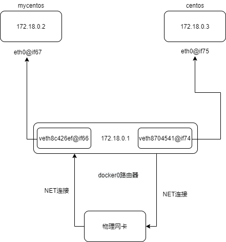

- 容器命令

    - **docker run [选项] 镜像名** 启动镜像
    
    ```shell script
    docker run --help
    
    Usage:  docker run [OPTIONS] IMAGE [COMMAND] [ARG...]
    
    Run a command in a new container
    
    Options:
      --name=""         # 容器名字 用于区分容器
      -d                # 后台方式运行
      -it               # 使用交互方式运行,进入容器查看内容
      -p	            # 指定容器的端口 -p 80:8080  主机端口:容器端口
      -P(大写)           # 随机指定端口
      -e, --env list    # 设置环境参数    


    ```
  
    运行镜像生成容器
    
    ```shell script
    [root@fuyi ~]# docker run --name fuyi-mysql -it -p 8806:3306 -e MYSQL_ROOT_PASSWORD=123456 mysql
    2020-09-29 01:37:40+00:00 [Note] [Entrypoint]: Entrypoint script for MySQL Server 8.0.21-1debian10 started.
    2020-09-29 01:37:40+00:00 [Note] [Entrypoint]: Switching to dedicated user 'mysql'
    2020-09-29 01:37:40+00:00 [Note] [Entrypoint]: Entrypoint script for MySQL Server 8.0.21-1debian10 started.
    2020-09-29 01:37:40+00:00 [Note] [Entrypoint]: Initializing database files
    2020-09-29T01:37:40.996343Z 0 [System] [MY-013169] [Server] /usr/sbin/mysqld (mysqld 8.0.21) initializing of server in progress as process 41
    2020-09-29T01:37:41.016474Z 1 [System] [MY-013576] [InnoDB] InnoDB initialization has started.
    2020-09-29T01:37:42.481701Z 1 [System] [MY-013577] [InnoDB] InnoDB initialization has ended.
    2020-09-29T01:37:44.572332Z 6 [Warning] [MY-010453] [Server] root@localhost is created with an empty password ! Please consider switching off the --initialize-insecure option.
    2020-09-29 01:37:48+00:00 [Note] [Entrypoint]: Database files initialized
    2020-09-29 01:37:48+00:00 [Note] [Entrypoint]: Starting temporary server
    mysqld will log errors to /var/lib/mysql/4d1f01fb0c5a.err
    mysqld is running as pid 90
    2020-09-29 01:37:50+00:00 [Note] [Entrypoint]: Temporary server started.
    Warning: Unable to load '/usr/share/zoneinfo/iso3166.tab' as time zone. Skipping it.
    Warning: Unable to load '/usr/share/zoneinfo/leap-seconds.list' as time zone. Skipping it.
    Warning: Unable to load '/usr/share/zoneinfo/zone.tab' as time zone. Skipping it.
    Warning: Unable to load '/usr/share/zoneinfo/zone1970.tab' as time zone. Skipping it.
    
    2020-09-29 01:37:53+00:00 [Note] [Entrypoint]: Stopping temporary server
    2020-09-29 01:37:56+00:00 [Note] [Entrypoint]: Temporary server stopped
    
    2020-09-29 01:37:56+00:00 [Note] [Entrypoint]: MySQL init process done. Ready for start up.
    
    2020-09-29T01:37:56.950671Z 0 [System] [MY-010116] [Server] /usr/sbin/mysqld (mysqld 8.0.21) starting as process 1
    2020-09-29T01:37:56.964090Z 1 [System] [MY-013576] [InnoDB] InnoDB initialization has started.
    2020-09-29T01:37:57.701207Z 1 [System] [MY-013577] [InnoDB] InnoDB initialization has ended.
    2020-09-29T01:37:57.906622Z 0 [System] [MY-011323] [Server] X Plugin ready for connections. Bind-address: '::' port: 33060, socket: /var/run/mysqld/mysqlx.sock
    2020-09-29T01:37:58.105695Z 0 [Warning] [MY-010068] [Server] CA certificate ca.pem is self signed.
    2020-09-29T01:37:58.105990Z 0 [System] [MY-013602] [Server] Channel mysql_main configured to support TLS. Encrypted connections are now supported for this channel.
    2020-09-29T01:37:58.109985Z 0 [Warning] [MY-011810] [Server] Insecure configuration for --pid-file: Location '/var/run/mysqld' in the path is accessible to all OS users. Consider choosing a different directory.
    2020-09-29T01:37:58.165655Z 0 [System] [MY-010931] [Server] /usr/sbin/mysqld: ready for connections. Version: '8.0.21'  socket: '/var/run/mysqld/mysqld.sock'  port: 3306  MySQL Community Server - GPL.
    ```
  
  - **docker image inspect** 查看镜像内部分层
  
  ```shell script
  [root@fuyi ~]# docker image inspect mysql
  "RootFS": {
              "Type": "layers",
              "Layers": [
                  "sha256:07cab433985205f29909739f511777a810f4a9aff486355b71308bb654cdc868",
                  "sha256:99f2b905661ad6da61a7daa03441f86868e5dc621ea9a53696f98d40a51361d4",
                  "sha256:705e0a5709e5bfe1bcad6bca71c0677e2088f49b387bc0c070135ab38209b575",
                  "sha256:73b2ff2d449dc8cc7525999a8876aec53f61066bff7649e4b0576a0355631c76",
                  "sha256:18c57f967c0e8c90e26279c89d172b3e84fac30c48fd14066bc1d0481895b161",
                  "sha256:4ff56402c7c53062e1c7aba89dab4779b4929bcc19f21564fcb2b35b3b8d0e63",
                  "sha256:d2055cc0a7aa80c180028c7970c43e09cefc492a0d323de2604e55c98cb398c2",
                  "sha256:e929be3696cafce09e09dc6f62fd48d4e23fe96a6583d1e66d03a78627d79725",
                  "sha256:2a0bd3a9cd29a9c065c946f5df05676a3996abd4c126769d06cbecbc839e62a1",
                  "sha256:d086c9717c2b03114f508febcfca6671f098054c283834731ce78411bfeac42e",
                  "sha256:35864924eb5e64b1fc86db107a241d1bc1e1b713e0faef59f60f88c2699c9b13",
                  "sha256:612c87e75ba549972e70f0224092d8722709304f2b69a91ad6cfb6315654a273"
              ]
          },

  ```
  
  - **docker ps** 查看容器
  
  ```shell script
    [root@fuyi ~]# docker ps --help
    
    Usage:  docker ps [OPTIONS]
    
    List containers
    
    Options:
      -a, --all             # 显示所有容器(默认只是显示运行的容器)
      -f, --filter filter   # 添加过滤条件筛选
          --format string   Pretty-print containers using a Go template
      -l, --latest          # 显示最近创建的容器 (includes all states)
      -q, --quiet           # 只显示容器ID
      -s, --size            # 显示文件大小
  
  
  [root@fuyi ~]# docker ps -s
  CONTAINER ID        IMAGE               COMMAND                  CREATED             STATUS              PORTS                               NAMES               SIZE
  4d1f01fb0c5a        mysql               "docker-entrypoint.s…"   6 minutes ago       Up 6 minutes        33060/tcp, 0.0.0.0:8806->3306/tcp   fuyi-mysql          7B (virtual 544MB)
  [root@fuyi ~]# docker ps 
  CONTAINER ID        IMAGE               COMMAND                  CREATED             STATUS              PORTS                               NAMES
  4d1f01fb0c5a        mysql               "docker-entrypoint.s…"   7 minutes ago       Up 7 minutes        33060/tcp, 0.0.0.0:8806->3306/tcp   fuyi-mysql
  [root@fuyi ~]# docker ps -a
  CONTAINER ID        IMAGE               COMMAND                  CREATED             STATUS              PORTS                               NAMES
  4d1f01fb0c5a        mysql               "docker-entrypoint.s…"   7 minutes ago       Up 7 minutes        33060/tcp, 0.0.0.0:8806->3306/tcp   fuyi-mysql
  [root@fuyi ~]# docker ps -q
  4d1f01fb0c5a
  [root@fuyi ~]# docker ps -l
  CONTAINER ID        IMAGE               COMMAND                  CREATED             STATUS              PORTS                               NAMES
  4d1f01fb0c5a        mysql               "docker-entrypoint.s…"   8 minutes ago       Up 8 minutes        33060/tcp, 0.0.0.0:8806->3306/tcp   fuyi-mysql
  ```
  
  - **docker exec** 进入容器内部
  
  ```shell script
    [root@fuyi ~]# docker exec --help
    
    Usage:  docker exec [OPTIONS] CONTAINER COMMAND [ARG...]
    
    Run a command in a running container
    
    Options:
      -d, --detach               # 分离模式：在后台运行命令
      -e, --env list             # 设置环境变量
      -i, --interactive          # 即使未连接STDIN也保持打开状态
          --privileged           # 赋予命令扩展权限
      -t, --tty                  # 分配伪TTY

    [root@fuyi ~]# docker ps -a
    CONTAINER ID        IMAGE               COMMAND                  CREATED             STATUS              PORTS                               NAMES
    4d1f01fb0c5a        mysql               "docker-entrypoint.s…"   17 minutes ago      Up 17 minutes       33060/tcp, 0.0.0.0:8806->3306/tcp   fuyi-mysql
    [root@fuyi ~]# docker exec -it fuyi-mysql /bin/bash      # 进入容器
    root@4d1f01fb0c5a:/# ls -a
    .  ..  .dockerenv  bin  boot  dev  docker-entrypoint-initdb.d  entrypoint.sh  etc  home  lib  lib64  media  mnt  opt  proc  root  run  sbin  srv  sys  tmp  usr  var
    root@4d1f01fb0c5a:/# exit;                               # 退出容器
    exit

  ```
  
  - **docker stop** 停止容器
  
  ```shell script
    [root@fuyi ~]# docker stop --help
    
    Usage:  docker stop [OPTIONS] CONTAINER [CONTAINER...]
    
    Stop one or more running containers  # 停止一个或者多个容器
    
    Options:
      -t, --time int                     # 定时多少秒后执行停止容器（默认为10秒）

    [root@fuyi ~]# docker ps -a
    CONTAINER ID        IMAGE               COMMAND                  CREATED             STATUS              PORTS                               NAMES
    4d1f01fb0c5a        mysql               "docker-entrypoint.s…"   20 minutes ago      Up 20 minutes       33060/tcp, 0.0.0.0:8806->3306/tcp   fuyi-mysql
    [root@fuyi ~]# docker stop fuyi-mysql
    fuyi-mysql
    [root@fuyi ~]# docker ps -a
    CONTAINER ID        IMAGE               COMMAND                  CREATED             STATUS                     PORTS               NAMES
    4d1f01fb0c5a        mysql               "docker-entrypoint.s…"   21 minutes ago      Exited (0) 4 seconds ago                       fuyi-mysql
  ```

  - **docker start/restart** 启动容器
  
  ```shell script
    [root@fuyi ~]# docker start 4d
    4d
    [root@fuyi ~]# docker ps -a
    CONTAINER ID        IMAGE               COMMAND                  CREATED             STATUS              PORTS                               NAMES
    4d1f01fb0c5a        mysql               "docker-entrypoint.s…"   23 minutes ago      Up 4 seconds        33060/tcp, 0.0.0.0:8806->3306/tcp   fuyi-mysql
    [root@fuyi ~]# docker restart 4d
    4d
    [root@fuyi ~]# docker ps -a
    CONTAINER ID        IMAGE               COMMAND                  CREATED             STATUS              PORTS                               NAMES
    4d1f01fb0c5a        mysql               "docker-entrypoint.s…"   24 minutes ago      Up 5 seconds        33060/tcp, 0.0.0.0:8806->3306/tcp   fuyi-mysql
  ```
  
  - **docker rm** 删除容器
  
  ```shell script
    [root@fuyi ~]# docker rm --help
    
    Usage:  docker rm [OPTIONS] CONTAINER [CONTAINER...]
    
    Remove one or more containers
    
    Options:
      -f, --force     # 强制删除一个正在运行的容器 (uses SIGKILL)
      -l, --link      # 移除指定的链接
      -v, --volumes   # 删除与容器关联的匿名卷
  
    [root@fuyi ~]# docker rm 4d
    Error response from daemon: You cannot remove a running container 4d1f01fb0c5a787d0752821ecc9479184c82dff6b723e3525ec84035ed921056. Stop the container before attempting removal or force remove
    [root@fuyi ~]# docker rm -f 4d
    4d
    [root@fuyi ~]# docker ps -a
    CONTAINER ID        IMAGE               COMMAND             CREATED             STATUS              PORTS               NAMES
    [root@fuyi ~]# 
  ```
  
  - **docker logs** 查看日志
  
  ```shell script
    [root@fuyi ~]# docker logs --help
    
    Usage:  docker logs [OPTIONS] CONTAINER
    
    Fetch the logs of a container  # 抓取一个容器的日志
    
    Options:
      -f, --follow         # 跟踪日志输出
          --since string   # 显示自时间戳记以来的日志 (e.g. 2013-01-02T13:23:37) or relative (e.g. 42m for 42 minutes)
          --tail string    # 从日志末尾开始显示的行数 (default "all")
      -t, --timestamps     # 显示时间戳
          --until string   # 在时间戳记之前显示日志 (e.g. 2013-01-02T13:23:37) or relative (e.g. 42m for 42 minutes)
  
  [root@fuyi ~]# docker logs -f fuyi-mysql
  2020-09-29 02:13:08+00:00 [Note] [Entrypoint]: Entrypoint script for MySQL Server 8.0.21-1debian10 started.
  2020-09-29 02:13:09+00:00 [Note] [Entrypoint]: Switching to dedicated user 'mysql'
  2020-09-29 02:13:09+00:00 [Note] [Entrypoint]: Entrypoint script for MySQL Server 8.0.21-1debian10 started.
  2020-09-29 02:13:09+00:00 [Note] [Entrypoint]: Initializing database files
  2020-09-29T02:13:09.990629Z 0 [System] [MY-013169] [Server] /usr/sbin/mysqld (mysqld 8.0.21) initializing of server in progress as process 41
  2020-09-29T02:13:09.997189Z 1 [System] [MY-013576] [InnoDB] InnoDB initialization has started.
  2020-09-29T02:13:11.606346Z 1 [System] [MY-013577] [InnoDB] InnoDB initialization has ended.
  2020-09-29T02:13:13.523611Z 6 [Warning] [MY-010453] [Server] root@localhost is created with an empty password ! Please consider switching off the --initialize-insecure option.
  2020-09-29 02:13:17+00:00 [Note] [Entrypoint]: Database files initialized
  2020-09-29 02:13:17+00:00 [Note] [Entrypoint]: Starting temporary server
  mysqld will log errors to /var/lib/mysql/08650f7ad9db.err
  mysqld is running as pid 90
  2020-09-29 02:13:19+00:00 [Note] [Entrypoint]: Temporary server started.
  Warning: Unable to load '/usr/share/zoneinfo/iso3166.tab' as time zone. Skipping it.
  Warning: Unable to load '/usr/share/zoneinfo/leap-seconds.list' as time zone. Skipping it.
  Warning: Unable to load '/usr/share/zoneinfo/zone.tab' as time zone. Skipping it.
  Warning: Unable to load '/usr/share/zoneinfo/zone1970.tab' as time zone. Skipping it.
  
  2020-09-29 02:13:23+00:00 [Note] [Entrypoint]: Stopping temporary server
  2020-09-29 02:13:27+00:00 [Note] [Entrypoint]: Temporary server stopped
  
  2020-09-29 02:13:27+00:00 [Note] [Entrypoint]: MySQL init process done. Ready for start up.
  
  2020-09-29T02:13:28.039354Z 0 [System] [MY-010116] [Server] /usr/sbin/mysqld (mysqld 8.0.21) starting as process 1
  2020-09-29T02:13:28.055260Z 1 [System] [MY-013576] [InnoDB] InnoDB initialization has started.
  2020-09-29T02:13:28.787734Z 1 [System] [MY-013577] [InnoDB] InnoDB initialization has ended.
  2020-09-29T02:13:29.017321Z 0 [System] [MY-011323] [Server] X Plugin ready for connections. Bind-address: '::' port: 33060, socket: /var/run/mysqld/mysqlx.sock
  2020-09-29T02:13:29.210331Z 0 [Warning] [MY-010068] [Server] CA certificate ca.pem is self signed.
  2020-09-29T02:13:29.210651Z 0 [System] [MY-013602] [Server] Channel mysql_main configured to support TLS. Encrypted connections are now supported for this channel.
  2020-09-29T02:13:29.215159Z 0 [Warning] [MY-011810] [Server] Insecure configuration for --pid-file: Location '/var/run/mysqld' in the path is accessible to all OS users. Consider choosing a different directory.
  2020-09-29T02:13:29.240800Z 0 [System] [MY-010931] [Server] /usr/sbin/mysqld: ready for connections. Version: '8.0.21'  socket: '/var/run/mysqld/mysqld.sock'  port: 3306  MySQL Community Server - GPL.

  ```
  
  - **docker top** 查看docker进程信息
  
  ```shell script
    [root@fuyi ~]# docker top --help
    
    Usage:  docker top CONTAINER [ps OPTIONS]
    
    Display the running processes of a container
  
  
    [root@fuyi ~]# docker top fuyi-mysql
    UID                 PID                 PPID                C                   STIME               TTY                 TIME                CMD
    systemd+            250511              250495              0                   10:13               pts/0               00:00:02            mysqld
  ```
  
  - **docker inspect** 查看容器的元数据
  
  ```shell script
    [root@fuyi ~]# docker inspect --help
    
    Usage:  docker inspect [OPTIONS] NAME|ID [NAME|ID...]
    
    Return low-level information on Docker objects
    
    Options:
      -f, --format string   Format the output using the given Go template
      -s, --size            Display total file sizes if the type is container
          --type string     Return JSON for specified type
  ```
  
  - **docker cp** 拷贝文件
  
  ```shell script
  [root@fuyi ~]# docker cp  --help
      
      # docker cp 容器id: 容器内路径 目的主机路径
      Usage:  docker cp [OPTIONS] CONTAINER:SRC_PATH DEST_PATH|-
              docker cp [OPTIONS] SRC_PATH|- CONTAINER:DEST_PATH
      
      # 在宿主机和容器间进行拷贝文件
      Copy files/folders between a container and the local filesystem
      
      # 使用“-”作为源以从stdin中读取tar归档文件并将其提取到容器中的目录目的地。
      # 使用“-”作为目标以流式传输tar的tar归档文件容器源到标准输出。
      
      Options:
        -a, --archive       Archive mode (copy all uid/gid information)
        -L, --follow-link   Always follow symbol link in SRC_PATH
  ```
  
  - **docker commit** 提交容器成为一个新的镜像
  
  ```shell script
  [root@fuyi ~]# docker commit --help
      
      # docker commit -m="提交的描述信息" -a="作者" 容器ID 目标镜像名:[tag]
      Usage:  docker commit [OPTIONS] CONTAINER [REPOSITORY[:TAG]]
      
      Create a new image from a container's changes
      
      Options:
        -a, --author string    # 作者 (e.g., "John Hannibal Smith <hannibal@a-team.com>")
        -c, --change list      # 将Dockerfile指令应用于创建的映像
        -m, --message string   # 提交信息
        -p, --pause            # 提交期间暂停容器（默认为true）

  ```
  
  
- Docker镜像

    - **概述**：相当于一个软件，集成了运行所需的环境和配置。
    
    - **获取**：远程仓库、通过DockerFile进行制作
    
    - **UnionFS**： 联合文件系统，每次修改完后文件系统都会层层叠加，它是Docker镜像的基础，通过进而实现制作各种具体的应用镜像。
    
    - **Docker镜像加载原理**
    
        docker的镜像实际上由一层一层的文件系统组成,这种层级的文件系统UnionFS。
        
        - bootfs(boot file system)主要包含bootlloader和kernel,bootfs主要是引导加载kernel,Linux刚启动时会加载bootfs文件系统,在docker镜像的最底层是bootfs,这一层与我们典型的Linux/Unix系统是一样的,包含boot加载器和内核,当boot加载完成之后整个内核就在内存中了,此时内存的使用权已由bootfa转交给内核,此时系统也会卸载bootfs
        
        - rootfs(root file system),在bootfs之上,包含的就是典型Linux系统中的/dev, /proc,/bin, /etc等标准目录和文件,rootfs就是各种不同的操作系统发行版,比如Ubuntu, CentOS等等
    
    - **安装进虚拟机的CentOS都是好几个G,为什么Docker这里才200M**?
    
        一个精简的OS,rootfs可以很小,只需要包含基本的命令,工具和程序库就可以了,因为底层直接用宿主机的kernel,自己只需要提供rootFS就可以了。由此可见对于不同的linux发行版,bootfs基本是一致的,rootfs会有差别,因此不同的发行版可以共用bootfs
    
    - **分层理解**
        
        当我们使用Docker去拉取一个镜像的时候，是一层一层镜像进行下载的，这样的好处是其他镜像能够共享同样的基础镜像，对于宿主机来说，我只需要保存一份基础镜像就可以了。
        
       
    
        
    
    
    
- 容器数据卷

    作用：进行容器与宿主机数据共享，实现容器的数据持久化。因为容器停止后再启动的数据就会丢失。
    
    - **docker run -it -v 主机目录: 容器内目录  -p 主机端口: 容器端口** 挂载数据卷
    
    - **docker run -it -v 容器内路径**   匿名挂载
    
    - **docker run -it -v 卷名：容器内路径**   具名挂载
    
    - **docker volume ls**  查看卷名
    
    - **docker volume inspect 卷名** 查看卷名
    
    
- DockerFile

   - 作用：用来制作镜像，本质是命令参数脚本文件
   
   - **常见指令**
   
   ```dockerfile
  FROM 	    # 基础镜像, 一切从这里开始构建
  MANTAINER   # 镜像是谁写的, 姓名+邮箱
  RUN         # 镜像构建的时候需要运行的命令
  ADD         # 步骤, tomcat镜像,压缩包! 添加内容
  WORKDIR     # 镜像的工作目录
  VOLUME      # 挂载的目录
  EXPOSE      # 暴露端口配置
  RUN         # 运行
  CMD         # 指定这个容器启动的时候要运行的命令,只有最后一个会生效,可被替代
  ENTRYPOINT  # 指定这个容器启动的时候要运行的命令,可以追加命令
  ONBUILD     # 当构建一个被继承 DockerFile 这个时候就会运行ONBUILD的指令,触发指令
  COPY	    # 类似ADD,将我们文件拷贝到镜像中
  ENV 	    # 构建的时候设置环境变量!      
   ```
  
  
  
  - **简易的Dockerfile文件**
  
  ```dockerfile
    # 创建一个dockerfile文件,名字可以随机 建议 dockerfile
    # 文件中的内容
    
    FROM centos
    
    VOLUME ["volume01","volume02"]
    
    CMD echo "---end---"
    CMD /bin/hash
  ```
  
  - **根据Dockerfile文件创建镜像
  
  ```shell script
  [root@VM-0-15-centos ~]# docker build -t mycentos:1.0 .
  Sending build context to Docker daemon  33.79kB
  Step 1/4 : FROM centos
  latest: Pulling from library/centos
  3c72a8ed6814: Pull complete 
  Digest: sha256:76d24f3ba3317fa945743bb3746fbaf3a0b752f10b10376960de01da70685fbd
  Status: Downloaded newer image for centos:latest
   ---> 0d120b6ccaa8
  Step 2/4 : VOLUME ["volume01","volume02"]
   ---> [Warning] IPv4 forwarding is disabled. Networking will not work.
   ---> Running in 2e825f9d305b
  Removing intermediate container 2e825f9d305b
   ---> 213b052e831a
  Step 3/4 : CMD echo "---end---"
   ---> [Warning] IPv4 forwarding is disabled. Networking will not work.
   ---> Running in 234336f39f7a
  Removing intermediate container 234336f39f7a
   ---> f540fa0eb26f
  Step 4/4 : CMD /bin/hash
   ---> [Warning] IPv4 forwarding is disabled. Networking will not work.
   ---> Running in ed3b26909878
  Removing intermediate container ed3b26909878
   ---> d9d535d67f5c
  Successfully built d9d535d67f5c
  Successfully tagged mycentos:1.0
  ```
  
  
  
  - **运行并进入容器**
  
  ```shell script
   [root@VM-0-15-centos ~]# docker images         
   REPOSITORY          TAG                 IMAGE ID            CREATED             SIZE
   mycentos            1.0                 d9d535d67f5c        2 minutes ago       215MB
   ruibaby/halo        latest              b3f0e81bbe82        6 days ago          450MB
   elasticsearch       7.9.2               caa7a21ca06e        7 days ago          763MB
   redis               6.0.8               84c5f6e03bf0        2 weeks ago         104MB
   centos              latest              0d120b6ccaa8        7 weeks ago         215MB
   [root@VM-0-15-centos ~]# docker run -it mycentos:1.0 /bin/bash    
   WARNING: IPv4 forwarding is disabled. Networking will not work.
   [root@5daef9f790d8 /]# ls -l
   total 56
   lrwxrwxrwx   1 root root    7 May 11  2019 bin -> usr/bin
   drwxr-xr-x   5 root root  360 Sep 30 01:58 dev
   drwxr-xr-x   1 root root 4096 Sep 30 01:58 etc
   drwxr-xr-x   2 root root 4096 May 11  2019 home
   lrwxrwxrwx   1 root root    7 May 11  2019 lib -> usr/lib
   lrwxrwxrwx   1 root root    9 May 11  2019 lib64 -> usr/lib64
   drwx------   2 root root 4096 Aug  9 21:40 lost+found
   drwxr-xr-x   2 root root 4096 May 11  2019 media
   drwxr-xr-x   2 root root 4096 May 11  2019 mnt
   drwxr-xr-x   2 root root 4096 May 11  2019 opt
   dr-xr-xr-x 116 root root    0 Sep 30 01:58 proc
   dr-xr-x---   2 root root 4096 Aug  9 21:40 root
   drwxr-xr-x  11 root root 4096 Aug  9 21:40 run
   lrwxrwxrwx   1 root root    8 May 11  2019 sbin -> usr/sbin
   drwxr-xr-x   2 root root 4096 May 11  2019 srv
   dr-xr-xr-x  13 root root    0 Sep 29 08:31 sys
   drwxrwxrwt   7 root root 4096 Aug  9 21:40 tmp
   drwxr-xr-x  12 root root 4096 Aug  9 21:40 usr
   drwxr-xr-x  20 root root 4096 Aug  9 21:40 var
   drwxr-xr-x   2 root root 4096 Sep 30 01:58 volume01      # 匿名挂载卷1
   drwxr-xr-x   2 root root 4096 Sep 30 01:58 volume02      # 匿名挂载卷2 
  ```
  
  - **查看挂载卷外部同步路径** 
  
  ```shell script
  docker inspect mycentos:1.0
  ```
  - **构建镜像步骤**
  
    -  编写一个dockerfile脚本
    
    - docker build 构建成为一个镜像
    
    ```shell script
    docker build -t nginx:latest -f ./nginx/Dockerfile   #-f指定Dockerfile文件
    ```
    
    - docker run 运行镜像
    
    - docker push发布镜像(Docker hub , 阿里云镜像仓库 , 私有仓库! )
    
    ```shell script
    docker tag hello-world:1.0 115.29.215.82:8000/spider/hello-world:1.0
    docker push 115.29.215.82:8000/spider/hello-world:1.0
    ```
    
  - **DockerFile构建过程**
  
    
  
    - 每个保留关键字(指令)都是必须要大写
    - 执行从上到下顺序执行
    - ‘#’ 表示注释
    - 每一个指令都会创建提交一个新的镜像层,并提交 !
  
  - **CMD指令和ENTRYPOINT指令的区别**
  
  ```shell script
  CMD # 指定这个容器启动的时候要运行的命令,只有最后一个会生效,可被替代
  ENTRYPOINT # 指定这个容器启动的时候要运行的命令,可以追加命令
  ```

  - **测试CMD指令**
  
  ```shell script
  [root@VM-0-15-centos ~]# vim dockerfile-centos-test
  [root@VM-0-15-centos ~]# docker build -f dockerfile-centos-test -t centostest .
  Sending build context to Docker daemon  36.35kB
  Step 1/2 : FROM centos
   ---> 0d120b6ccaa8
  Step 2/2 : CMD ["ls","-a"]
   ---> [Warning] IPv4 forwarding is disabled. Networking will not work.
   ---> Running in a274579a6b3a
  Removing intermediate container a274579a6b3a
   ---> b23dd34707a2
  Successfully built b23dd34707a2
  Successfully tagged centostest:latest
  [root@VM-0-15-centos ~]# docker images
  REPOSITORY          TAG                 IMAGE ID            CREATED             SIZE
  centostest          latest              b23dd34707a2        50 seconds ago      215MB
  mycentos            1.0                 d9d535d67f5c        9 days ago          215MB
  ruibaby/halo        latest              b3f0e81bbe82        2 weeks ago         450MB
  elasticsearch       7.9.2               caa7a21ca06e        2 weeks ago         763MB
  redis               6.0.8               84c5f6e03bf0        4 weeks ago         104MB
  centos              latest              0d120b6ccaa8        8 weeks ago         215MB
  [root@VM-0-15-centos ~]# docker run -it centostest:latest -l
  WARNING: IPv4 forwarding is disabled. Networking will not work.
  docker: Error response from daemon: OCI runtime create failed: container_linux.go:349: starting container process caused "exec: \"-l\": executable file not found in $PATH": unknown.
  ```
  
  - **小结**
  
  

- Docker网络

  **docker容器是否拥有IP地址？并且物理机Linux是否能够ping通docker容器？**
  
  ```shell script
  [root@VM-0-15-centos ~]# docker ps -a
  CONTAINER ID        IMAGE               COMMAND             CREATED             STATUS              PORTS               NAMES
  8fee3bf69031        centostest:latest   "-l"                14 minutes ago      Created                                 nervous_northcutt
  5daef9f790d8        mycentos:1.0        "/bin/bash"         9 days ago          Up 9 days                               nice_ritchie
  [root@VM-0-15-centos ~]# docker exec -it 5d ip addr     #查看IP地址
  1: lo: <LOOPBACK,UP,LOWER_UP> mtu 65536 qdisc noqueue state UNKNOWN group default qlen 1000
      link/loopback 00:00:00:00:00:00 brd 00:00:00:00:00:00
      inet 127.0.0.1/8 scope host lo
         valid_lft forever preferred_lft forever
  66: eth0@if67: <BROADCAST,MULTICAST,UP,LOWER_UP> mtu 1500 qdisc noqueue state UP group default 
      link/ether 02:42:ac:12:00:02 brd ff:ff:ff:ff:ff:ff link-netnsid 0
      inet 172.18.0.2/16 brd 172.18.255.255 scope global eth0
         valid_lft forever preferred_lft forever
  [root@VM-0-15-centos ~]# ping 172.18.0.2               #测试ping
  PING 172.18.0.2 (172.18.0.2) 56(84) bytes of data.
  64 bytes from 172.18.0.2: icmp_seq=1 ttl=64 time=0.077 ms
  64 bytes from 172.18.0.2: icmp_seq=2 ttl=64 time=0.056 ms
  64 bytes from 172.18.0.2: icmp_seq=3 ttl=64 time=0.063 ms
  64 bytes from 172.18.0.2: icmp_seq=4 ttl=64 time=0.068 ms
  64 bytes from 172.18.0.2: icmp_seq=5 ttl=64 time=0.065 ms
  64 bytes from 172.18.0.2: icmp_seq=6 ttl=64 time=0.057 ms
  64 bytes from 172.18.0.2: icmp_seq=7 ttl=64 time=0.061 ms
  ^C
  --- 172.18.0.2 ping statistics ---
  7 packets transmitted, 7 received, 0% packet loss, time 5999ms
  rtt min/avg/max/mdev = 0.056/0.063/0.077/0.012 ms
  ```
  
  - 再启动CentOS容器
  
  ```shell script
  [root@VM-0-15-centos ~]# docker images
  REPOSITORY          TAG                 IMAGE ID            CREATED             SIZE
  centostest          latest              b23dd34707a2        46 minutes ago      215MB
  mycentos            1.0                 d9d535d67f5c        9 days ago          215MB
  ruibaby/halo        latest              b3f0e81bbe82        2 weeks ago         450MB
  elasticsearch       7.9.2               caa7a21ca06e        2 weeks ago         763MB
  redis               6.0.8               84c5f6e03bf0        4 weeks ago         104MB
  redis               latest              84c5f6e03bf0        4 weeks ago         104MB
  centos              latest              0d120b6ccaa8        8 weeks ago         215MB
  [root@VM-0-15-centos ~]# docker run -it centos:latest
  WARNING: IPv4 forwarding is disabled. Networking will not work.
  [root@dd639c4846d3 /]# ip addr
  1: lo: <LOOPBACK,UP,LOWER_UP> mtu 65536 qdisc noqueue state UNKNOWN group default qlen 1000
      link/loopback 00:00:00:00:00:00 brd 00:00:00:00:00:00
      inet 127.0.0.1/8 scope host lo
         valid_lft forever preferred_lft forever
  74: eth0@if75: <BROADCAST,MULTICAST,UP,LOWER_UP> mtu 1500 qdisc noqueue state UP group default 
      link/ether 02:42:ac:12:00:03 brd ff:ff:ff:ff:ff:ff link-netnsid 0
      inet 172.18.0.3/16 brd 172.18.255.255 scope global eth0
         valid_lft forever preferred_lft forever
  [root@dd639c4846d3 /]# ^C
  ```
  
  - 查看IP地址
  
  ```shell script
   [root@VM-0-15-centos ~]# ip addr
   1: lo: <LOOPBACK,UP,LOWER_UP> mtu 65536 qdisc noqueue state UNKNOWN group default qlen 1000
       link/loopback 00:00:00:00:00:00 brd 00:00:00:00:00:00
       inet 127.0.0.1/8 scope host lo
          valid_lft forever preferred_lft forever
       inet6 ::1/128 scope host 
          valid_lft forever preferred_lft forever
   2: eth0: <BROADCAST,MULTICAST,UP,LOWER_UP> mtu 1500 qdisc pfifo_fast state UP group default qlen 1000
       link/ether 52:54:00:c6:e7:08 brd ff:ff:ff:ff:ff:ff
       inet 172.17.0.15/20 brd 172.17.15.255 scope global eth0
          valid_lft forever preferred_lft forever
       inet6 fe80::5054:ff:fec6:e708/64 scope link 
          valid_lft forever preferred_lft forever
   3: docker0: <BROADCAST,MULTICAST,UP,LOWER_UP> mtu 1500 qdisc noqueue state UP group default 
       link/ether 02:42:0d:72:1c:ac brd ff:ff:ff:ff:ff:ff
       inet 172.18.0.1/16 brd 172.18.255.255 scope global docker0
          valid_lft forever preferred_lft forever
       inet6 fe80::42:dff:fe72:1cac/64 scope link 
          valid_lft forever preferred_lft forever
  
  ## mycentos:1.0的网络IP地址
   67: veth8c426ef@if66: <BROADCAST,MULTICAST,UP,LOWER_UP> mtu 1500 qdisc noqueue master docker0 state UP group default 
       link/ether ae:fe:47:e8:20:4d brd ff:ff:ff:ff:ff:ff link-netnsid 0
       inet6 fe80::acfe:47ff:fee8:204d/64 scope link 
          valid_lft forever preferred_lft forever
  ## CentOS：latest的网络IP地址
   75: veth8704541@if74: <BROADCAST,MULTICAST,UP,LOWER_UP> mtu 1500 qdisc noqueue master docker0 state UP group default 
       link/ether 62:cb:8c:90:e3:7f brd ff:ff:ff:ff:ff:ff link-netnsid 1
       inet6 fe80::60cb:8cff:fe90:e37f/64 scope link 
          valid_lft forever preferred_lft forever
   [root@VM-0-15-centos ~]# 
  ```
  
  - **小结**
  
  
  


   
   


    
    
    