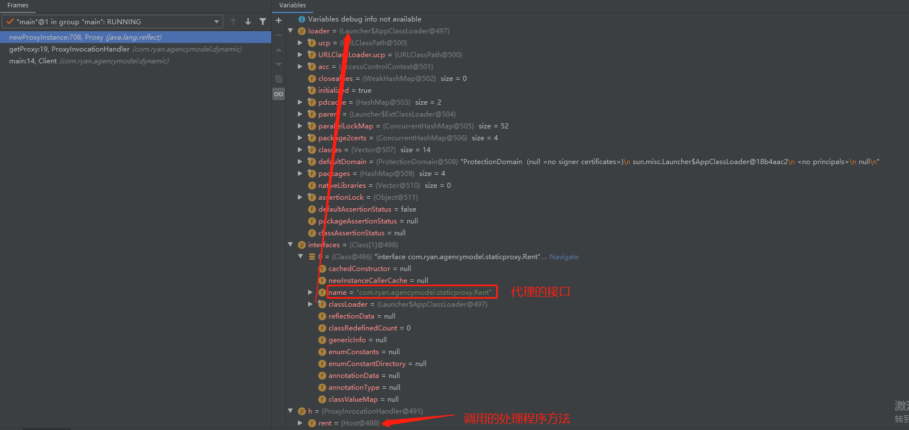

## 代理模式

   - 角色分析
   
      - 抽象角色：一般是接口或者抽象类
      
      - 真实角色：被代理的角色
      
      - 代理角色：代理真实角色后在其基础上增加附属操作
      
      - 客户： 访问对象的人

   - 静态代理
   
      - 创建抽象角色
      
        ```java
        package com.ryan.agencymodel.staticproxy;
        
        /**
         * 静态代理
         *
         */
        public interface StaticProxy {
        
            /**
             * 抽象角色：出租
             */
            void rent();
        }
        ```
        
      - 真实角色
      
        ```java
        package com.ryan.agencymodel.staticproxy;
        
        /**
         * 真实角色
         */
        public class Host implements Rent {
            @Override
            public void rent() {
                System.out.println("出租");
            }
        }
        ```
      - 代理角色
      
        ```java
        package com.ryan.agencymodel.staticproxy;
        
        /**
         * 代理角色
         */
        public class Proxy implements Rent {
        
            private Host host;
        
            public Proxy() {
        
            }
        
            public Proxy(Host host) {
                this.host = host;
            }
        
            @Override
            public void rent() {
                this.sell();
                host.rent();
                this.tip();
            }
        
            public void sell() {
                System.out.println("推销");
            }
        
            public void tip() {
                System.out.println("收取中介费用");
            }
        }
        ```
        
      - 访问对象
      
        ```java
        package com.ryan.agencymodel.staticproxy;
        
        public class Client {
        
            public static void main(String[] args) {
        
                //出租资源
                Host host = new Host();
        
                //中介接盘
                Proxy proxy = new Proxy(host);
        
                //客户租赁
                proxy.rent();
            }
        }

        ```
        
      - 总结
      
        **我们在不改变原来的代码的情况下，实现了对原有功能的增强，这是AOP中最核心的思想**
      
        - 优点
      
            - 公共业务的由代理角色进行扩展，使得真实角色不用再去过多的关注公共的部分；
        
            - 要扩展公共业务显得更加集中和方便。
        
        - 缺点
        
            - 类变多了，代码维护起来效率变低了
      
   - 动态代理
   
     说明：上面静态代理出现的缺点问题，能否进行进一步的优化，于是就出现了动态代理模式。动态代理是代理类动态生成，静态代理类是我们事先写好。
     
     - 基于接口动态代理
     
        - 抽象角色
        
          ```java
          package com.ryan.agencymodel.staticproxy;
          
          /**
           * 静态代理
           *
           */
          public interface Rent {
          
              /**
               * 抽象角色：出租
               */
              void rent();
          }

          ```
          
        - 真实角色
        
          ```java

          ```
        
        - 代理角色
        
          ```java
          package com.ryan.agencymodel.dynamic;
          
          import com.ryan.agencymodel.staticproxy.Rent;
          
          import java.lang.reflect.InvocationHandler;
          import java.lang.reflect.Method;
          import java.lang.reflect.Proxy;
          
          public class ProxyInvocationHandler implements InvocationHandler {
          
              private Rent rent;
          
              public void setRent(Rent rent) {
                  this.rent = rent;
              }
          
              //生成代理类，重点是第二个参数，获取要代理的抽象角色！之前都是一个角色，现在可以代理一类角色
              public Object getProxy(){
                  return Proxy.newProxyInstance(this.getClass().getClassLoader(),
                          rent.getClass().getInterfaces(),this);
              }
          
          
              // proxy : 代理类 method : 代理类的调用处理程序的方法对象.
              // 处理代理实例上的方法调用并返回结果
              @Override
              public Object invoke(Object proxy, Method method, Object[] args) throws Throwable {
                  this.sell();
                  Object result = method.invoke(rent, args);
                  this.tip();
                  return result;
              }
          
              public void sell() {
                  System.out.println("推销");
              }
          
              public void tip() {
                  System.out.println("收取中介费用");
              }
          }

          ```
        
        - 测试结果
        
          ```java
          package com.ryan.agencymodel.dynamic;
          
          import com.ryan.agencymodel.staticproxy.Host;
          import com.ryan.agencymodel.staticproxy.Rent;
          
          public class Client {
          
              public static void main(String[] args) {
                  //真实角色
                  Host host = new Host();
                  //代理实例的调用处理程序
                  ProxyInvocationHandler pih = new ProxyInvocationHandler();
                  pih.setRent(host); //将真实角色放置进去！
                  Rent proxy = (Rent)pih.getProxy(); //动态生成对应的代理类！
                  proxy.rent();
              }
          
          }

          ```
          
        - 源码分析
        
          - 生成代理类
          ```java
          Rent proxy = (Rent)pih.getProxy();
          public Object getProxy(){
                  return Proxy.newProxyInstance(this.getClass().getClassLoader(),
                          rent.getClass().getInterfaces(),this);
              }
          ```
          
          - 进入newProxyInstance
          
          ```java
          public static Object newProxyInstance(ClassLoader loader,
                                                    Class<?>[] interfaces,
                                                    InvocationHandler h)
                  throws IllegalArgumentException
              {        
              }
          ```
          
          - 图解
          
          
          
          - 总结
          
            一个动态代理 , 一般代理某一类业务 , 一个动态代理可以代理多个类，代理的是接口！底层还是通过反射机制实现。
          
     - 基于类的动态代理
     
     